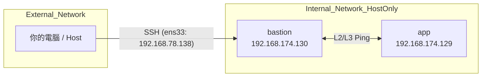
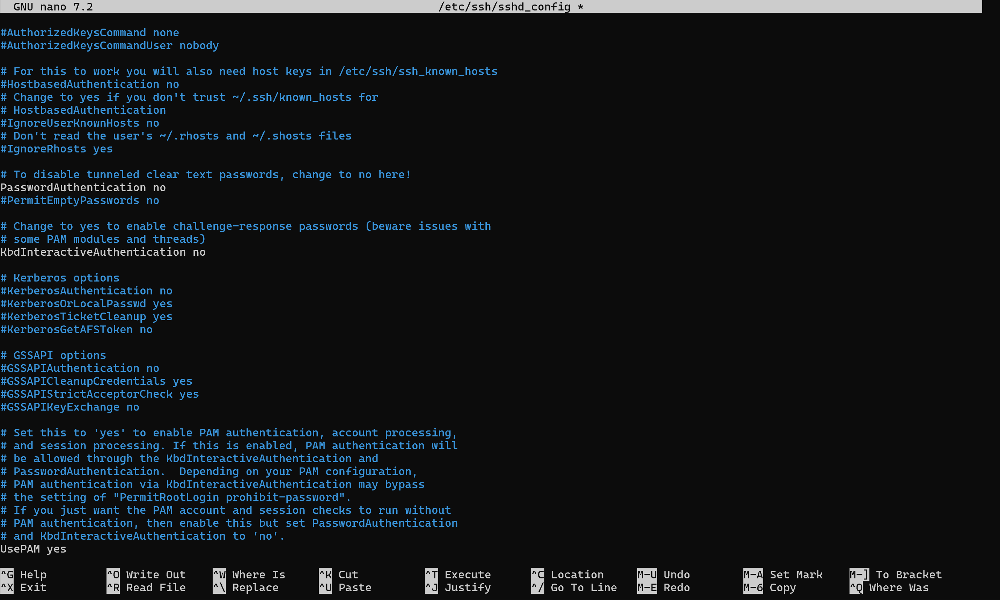

# 期中實作 — 411630428 賴政宏

## 1. 架構與 IP 表

- **架構**
    ```mermaid
    flowchart LR
        Host[Host / 你的電腦]
        Bastion[bastion VM<br/>NAT + Host-only]
        App[app VM<br/>Host-only only<br/>Docker: nginx]

        Host -- SSH 22 --> Bastion
        Bastion -- SSH 22 --> App
        Bastion -. curl 8080 .-> App
    ```

- **IP 表**  
    | VM | Hostname | 網卡名稱 | IP 位址 | 角色 |
    | :--- | :--- | :--- | :--- | :--- |
    | **bastion** | `bastion` | ens33 (NAT) | `192.168.78.138` | 唯一入口 / 跳板機 |
    | | | ens37 (Host-only) | `192.168.174.130` | 內部通訊網關 |
    | **app** | `app` | ens33 (Host-only) | `192.168.174.129` | 應用服務 / Nginx 容器 |

## 2. Part A：VM 與網路

### 2.1 網路介面配置表
根據實作環境，兩台 VM 的網卡與 IP 配置如下：

| VM 主機名 | 網卡名稱 | 網路模式 | IP 位址 | 角色 |
| :--- | :--- | :--- | :--- | :--- |
| **bastion** | ens33 | NAT | `192.168.78.138` | 對外連線 / SSH 入口 |
| **bastion** | ens37 | Host-only | `192.168.174.130` | 對內網段 (Gateway) |
| **app** | ens33 | Host-only | `192.168.174.129` | 內部服務節點 |

### 2.2 網路拓樸圖 (Mermaid)


### 2.3 連通性測試
- **bastion ip address**
  ```bash
  hung@app:~$ ip -4 addr show
    1: lo: <LOOPBACK,UP,LOWER_UP> mtu 65536 qdisc noqueue state UNKNOWN group default qlen 1000
        inet 127.0.0.1/8 scope host lo
        valid_lft forever preferred_lft forever
    2: ens33: <BROADCAST,MULTICAST,UP,LOWER_UP> mtu 1500 qdisc fq_codel state UP group default qlen 1000
        altname enp2s1
        inet 192.168.174.129/24 brd 192.168.174.255 scope global dynamic noprefixroute ens33
        valid_lft 1533sec preferred_lft 1533sec
  ```
- **app ip address**
  ```bash
  hung@bastion:~$ ip -4 addr show
    1: lo: <LOOPBACK,UP,LOWER_UP> mtu 65536 qdisc noqueue state UNKNOWN group default qlen 1000
        inet 127.0.0.1/8 scope host lo
        valid_lft forever preferred_lft forever
    2: ens33: <BROADCAST,MULTICAST,UP,LOWER_UP> mtu 1500 qdisc fq_codel state UP group default qlen 1000
        altname enp2s1
        inet 192.168.78.138/24 brd 192.168.78.255 scope global dynamic noprefixroute ens33
        valid_lft 1768sec preferred_lft 1768sec
    3: ens37: <BROADCAST,MULTICAST,UP,LOWER_UP> mtu 1500 qdisc fq_codel state UP group default qlen 1000
        altname enp2s5
        inet 192.168.174.130/24 brd 192.168.174.255 scope global dynamic noprefixroute ens37
        valid_lft 1768sec preferred_lft 1768sec
    4: docker0: <NO-CARRIER,BROADCAST,MULTICAST,UP> mtu 1500 qdisc noqueue state DOWN group default 
        inet 172.17.0.1/16 brd 172.17.255.255 scope global docker0
        valid_lft forever preferred_lft forever
  ```
- **bastion ping app**
    ```bash
    hung@bastion:~$ ping 192.168.174.129
    PING 192.168.174.129 (192.168.174.129) 56(84) bytes of data.
    64 bytes from 192.168.174.129: icmp_seq=1 ttl=64 time=2.38 ms
    64 bytes from 192.168.174.129: icmp_seq=2 ttl=64 time=0.799 ms
    64 bytes from 192.168.174.129: icmp_seq=3 ttl=64 time=1.95 ms
    64 bytes from 192.168.174.129: icmp_seq=4 ttl=64 time=1.50 ms
    64 bytes from 192.168.174.129: icmp_seq=5 ttl=64 time=1.74 ms
    ^C
    --- 192.168.174.129 ping statistics ---
    5 packets transmitted, 5 received, 0% packet loss, time 4021ms
    rtt min/avg/max/mdev = 0.799/1.674/2.383/0.525 ms
    ```
- **app ping bastion**
    ```bash
    hung@app:~$ ping 192.168.174.130
    PING 192.168.174.130 (192.168.174.130) 56(84) bytes of data.
    64 bytes from 192.168.174.130: icmp_seq=1 ttl=64 time=2.01 ms
    64 bytes from 192.168.174.130: icmp_seq=2 ttl=64 time=2.40 ms
    64 bytes from 192.168.174.130: icmp_seq=3 ttl=64 time=1.31 ms
    64 bytes from 192.168.174.130: icmp_seq=4 ttl=64 time=2.88 ms
    64 bytes from 192.168.174.130: icmp_seq=5 ttl=64 time=1.57 ms
    ^C
    --- 192.168.174.130 ping statistics ---
    5 packets transmitted, 5 received, 0% packet loss, time 4009ms
    rtt min/avg/max/mdev = 1.312/2.036/2.884/0.564 ms
    ```

## 3. Part B：金鑰、ufw、ProxyJump
<防火牆規則表 + ssh app 成功證據>

### 3.1 SSH 免密碼登入設定
1. **Host 端生成金鑰**：`ssh-keygen -t ed25519`
2. **佈署金鑰到兩台 VM (host)**：
   ```powershell
   PS C:\Users\Kenny> type $env:USERPROFILE\.ssh\id_ed25519.pub | ssh hung@192.168.78.138 "mkdir -p ~/.ssh && cat >> ~/.ssh/authorized_keys" # 佈署到 bastion
   PS C:\Users\Kenny> type $env:USERPROFILE\.ssh\id_ed25519.pub | ssh hung@192.168.174.129 "mkdir -p ~/.ssh && cat >> ~/.ssh/authorized_keys" # 佈署到 app (需先暫時維持連通)
   ```
3. **安全性強化**
- 已於兩台 VM 的 /etc/ssh/sshd_config 將 PasswordAuthentication 設為 no 並重啟服務。
  - bastion
    ```bash
    hung@bastion:~$ cat /etc/ssh/sshd_config | grep "PasswordAuthentication" | head -n 1
    PasswordAuthentication no
    ```
  - app
    ```bash
    hung@app:~$ cat /etc/ssh/sshd_config | grep "PasswordAuthentication" | head -n 1
    PasswordAuthentication no
    ```
    

### 3.2 防火牆規則 (ufw) 配置
  - bastion
    ```bash
    hung@bastion:~$ sudo ufw default deny incoming
    sudo ufw allow 22/tcp
    sudo ufw enable
    [sudo] password for hung:
    Default incoming policy changed to 'deny'
    (be sure to update your rules accordingly)
    
    Rules updated
    Rules updated (v6)
    Command may disrupt existing ssh connections. Proceed with operation (y|n)? y
    Firewall is active and enabled on system startup
    ```
  - app
    ```bash
    hung@app:~$ sudo ufw default deny incoming
    sudo ufw allow from 192.168.174.130 to any port 22 proto tcp
    sudo ufw enable
    [sudo] password for hung:
    Default incoming policy changed to 'deny'
    (be sure to update your rules accordingly)
    Rule added
    Command may disrupt existing ssh connections. Proceed with operation (y|n)? y
    Firewall is active and enabled on system startup
    ```
### 3.3 ProxyJump 設定 (Host 端)
```powershell
PS C:\Users\Kenny\.ssh> cat config

Host bastion
    HostName 192.168.78.138
    User hung

Host app
    HostName 192.168.174.129
    User hung
    ProxyJump bastion
```

### 3.4 驗證 ssh ProxyJump
```bash
PS C:\Users\Kenny> ssh app
Welcome to Ubuntu 24.04.4 LTS (GNU/Linux 6.17.0-19-generic x86_64)

* Documentation:  https://help.ubuntu.com
* Management:     https://landscape.canonical.com
* Support:        https://ubuntu.com/pro

Expanded Security Maintenance for Applications is not enabled.

113 updates can be applied immediately.
70 of these updates are standard security updates.
To see these additional updates run: apt list --upgradable

Enable ESM Apps to receive additional future security updates.
See https://ubuntu.com/esm or run: sudo pro status

Failed to connect to https://changelogs.ubuntu.com/meta-release-lts. Check your Internet connection or proxy settings

Last login: Thu Apr 23 05:12:39 2026 from 192.168.174.130
hung@app:~$
```

## 4. Part C：Docker 服務

### 4.1 安裝 Docker (app VM)
在 `app` 上執行安裝並啟動服務：
```bash
sudo apt update && sudo apt install docker.io -y
sudo systemctl enable --now docker
```

### 4.2 檢查 Docker 守護進程 (Daemon)
```bash
hung@app:~$ sudo systemctl status docker 
● docker.service - Docker Application Container Engine
     Loaded: loaded (/usr/lib/systemd/system/docker.service; enabled; preset: e>
     Active: active (running) since Thu 2026-04-23 05:37:57 CST; 49s ago
TriggeredBy: ● docker.socket
       Docs: https://docs.docker.com
   Main PID: 4284 (dockerd)
      Tasks: 9
     Memory: 121.9M (peak: 122.4M)
        CPU: 386ms
     CGroup: /system.slice/docker.service
             └─4284 /usr/bin/dockerd -H fd:// --containerd=/run/containerd/cont>

Apr 23 05:37:56 app dockerd[4284]: time="2026-04-23T05:37:56.759388622+08:00" l>
Apr 23 05:37:56 app dockerd[4284]: time="2026-04-23T05:37:56.772959637+08:00" l>
Apr 23 05:37:56 app dockerd[4284]: time="2026-04-23T05:37:56.777923433+08:00" l>
Apr 23 05:37:57 app dockerd[4284]: time="2026-04-23T05:37:57.110159978+08:00" l>
Apr 23 05:37:57 app dockerd[4284]: time="2026-04-23T05:37:57.131656640+08:00" l>
Apr 23 05:37:57 app dockerd[4284]: time="2026-04-23T05:37:57.131742878+08:00" l>
Apr 23 05:37:57 app dockerd[4284]: time="2026-04-23T05:37:57.157430303+08:00" l>
Apr 23 05:37:57 app dockerd[4284]: time="2026-04-23T05:37:57.162288021+08:00" l>
Apr 23 05:37:57 app dockerd[4284]: time="2026-04-23T05:37:57.162318599+08:00" l>
Apr 23 05:37:57 app systemd[1]: Started docker.service - Docker Application Con
```

### 4.3 執行 Nginx 容器 
```bash
hung@app:~$ sudo docker run -d --name web -p 8080:80 nginx
Unable to find image 'nginx:latest' locally
latest: Pulling from library/nginx
801a1ad15b4e: Pull complete 
3531af2bc2a9: Pull complete 
ce776bbcda0d: Pull complete 
85c66128325a: Pull complete 
4677c2a9a3d4: Pull complete 
ff048f1f2159: Pull complete 
677c63196868: Pull complete 
54c38c75806e: Download complete 
69989ccd189b: Download complete 
Digest: sha256:6e23479198b998e5e25921dff8455837c7636a67111a04a635cf1bb363d199dc
Status: Downloaded newer image for nginx:latest
0e045ad5de9fad35082b7f9aad2d27cf07db5a3020f29a6012ddea5a0a22f9b2
```

### 4.4 跨機連線驗證 (Bastion -> App)
```powershell
hung@bastion:~$ curl -I http://192.168.174.129:8080
HTTP/1.1 200 OK
Server: nginx/1.29.8
Date: Wed, 22 Apr 2026 21:53:53 GMT
Content-Type: text/html
Content-Length: 896
Last-Modified: Tue, 07 Apr 2026 11:37:12 GMT
Connection: keep-alive
ETag: "69d4ec68-380"
Accept-Ranges: bytes
```

## 5. Part D：故障演練

### 故障 1：F1 - 網路介面故障 (L2/L3 層級)
- **注入方式**：在 `app` VM 執行 `sudo ip link set ens33 down`
- **故障前**：從 Host 執行 `ssh app` 可正常登入
  
- 從 bastion `ping 192.168.174.129` 有回應。
  

- **故障中**：
  - 執行 `sudo ip link set ens33 down`
  
  - `ssh app` 出現 `Connection timed out`。
  
  - 從 bastion `ping 192.168.174.129` 顯示 `Destination Host Unreachable`。
  

- **回復後**：在 `app` 執行 `sudo ip link set ens33 up`，網路恢復正常。
  
- `ssh app` 正常
  
- 從 bastion `ping 192.168.174.129` 正常
  
- **診斷推論**：由於 `ping` 完全不通且顯示不可達，代表基礎網路層（L3）已斷開，封包根本無法到達目標機器。

### 故障 2：F3 - Docker 服務停止 (服務層級)
- **注入方式**：在 `app` VM 執行 `sudo systemctl stop docker`
- **故障前**：從 bastion 執行 `curl -I http://192.168.174.129:8080` 回傳 `HTTP/1.1 200 OK`。
  
- **故障中**：
  - 在 `app` VM 執行 `sudo systemctl stop docker`
  

  - `ssh app` 依然可以正常登入（證實網路與 SSH 服務正常）。 
  

  - 從 bastion 執行 `curl` 出現 `curl: (7) Failed to connect to 192.168.174.129 port 8080: Connection refused`。
  

- **回復後**：在 `app` 執行 `sudo systemctl start docker`，服務恢復。
- **curl nginx**
  
  
- **診斷推論**：此故障屬於服務層。連線被「Refused」而非「Timeout」，代表目標機器活著且防火牆沒擋，但對應的 Port 沒有程式（Docker Daemon）在監聽。

---

### 症狀辨識：如何分辨 Timeout (F1 vs F2)？
> **情境**：若故障 F1（網卡關閉）與 F2（防火牆擋掉）在 Host 端看到的都是 `ssh timeout`，應如何判斷根因？

**我的診斷推理鏈：**
1. **檢查 L3 連通性 (Ping)**：
   - 如果 `ping` 不通，且顯示 `Unreachable`，極可能是 **F1 (網卡/網路層)** 問題。
   - 如果 `ping` 竟然會通，但只有 SSH 連不上，那一定是 **F2 (防火牆)** 攔截了 Port 22。
2. **檢查 ARP 表 (L2)**：
   - 在 `bastion` 執行 `ip neighbor` 或 `arp -a`。
   - 若看不到 `app` 的 MAC 位址，代表 L2 鏈路斷了 (**F1**)。
   - 若看得到 MAC 位址但連不上，代表對方機器在線上，只是不理會你的請求 (**F2**)。
3. **查看防火牆狀態**：
   - 進入 `app` 本機執行 `sudo ufw status` 直接確認規則是否被更動。

## 6. 反思（200 字）
這次做完，對「分層隔離」或「timeout 不等於壞了」的理解有什麼改變？
```
這次實作讓我深刻體會到「分層防禦」在運維安全中的重要性。透過 Bastion 與 App 的兩層式架構，我們能將敏感的應用伺服器完全隱藏在私有網段中，僅開放受信任的跳板機透過特定網卡進入，極大化減少了外部攻擊面。

在排錯過程中，我對「連線失敗」有了更細緻的理解。過去看到連不上可能只覺得是服務壞了，但現在我能根據症狀精確定位：`Connection timed out` 通常指向網路層 (L3) 斷開或防火牆 (L4) 靜默丟棄封包，封包如同掉入黑洞；而 `Connection refused` 則暗示網路通暢且防火牆放行，只是目標埠號沒有服務在監聽。這種對 TCP 三向交握失敗階段的判斷，是快速區分「網路故障」與「服務崩潰」的關鍵。

最後，透過 SSH ProxyJump 的設定，我學會了如何在複雜的網路隔離下，依然保持操作的便利性。這種在「高安全性」與「操作效率」之間取得平衡的架構設計，是管理現代化雲端基礎設施時不可或缺的核心技能。
```
## 7. Bonus（選做）
