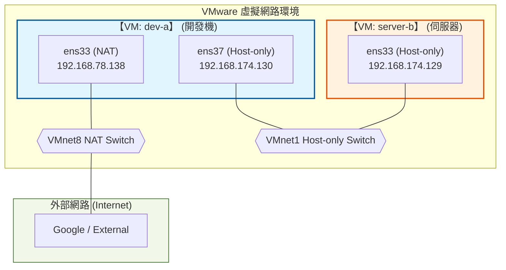

# W02｜VMware 網路模式與雙 VM 排錯

## 網路配置

| VM | 網卡 | 模式 | IP | 用途 |
|---|---|---|---|---|
| dev-a | ens33 | NAT | 192.168.78.138/24 | 上網 |
| dev-a | ens37 | Host-only | 192.168.174.130/24 | 內網互連 |
| server-b | ens33 | Host-only | 192.168.174.129/24 | 內網互連 |

## 三種模式差異摘要

- **NAT**: VM 透過 Host 的實體 IP 存取外網，外部無法主動連入。適合需要上網但不需要對外服務的 VM。
- **Bridged**: VM 網卡直接橋接到實體網路，與 Host 處於同網段，適合需要被區域網路其他裝置存取時使用。
- **Host-only**: 完全隔離的私有網路，僅限 VM 與 Host 通訊，IP 配置最穩定，適合封閉實驗環境。

## 採用 NAT + Host-only 雙網卡設計的理由

- 達成「職責分離」：由 NAT 介面負責對外連線（如 `apt update`），而 Host-only 介面則提供一個穩定、受控且不受實體網路干擾的內網環境，方便 `dev-a` 管理 `server-b`。

## 連線驗證紀錄

- [x] dev-a NAT 可上網：`ping google.com` 輸出
    ```bash
    hung@dev-a:~$ ping google.com
    PING google.com (142.250.196.206) 56(84) bytes of data.
    64 bytes from nctsaa-ac-in-f14.1e100.net (142.250.196.206): icmp_seq=1 ttl=128 time=5.68 ms
    64 bytes from nctsaa-ac-in-f14.1e100.net (142.250.196.206): icmp_seq=2 ttl=128 time=6.34 ms
    64 bytes from nctsaa-ac-in-f14.1e100.net (142.250.196.206): icmp_seq=3 ttl=128 time=6.89 ms
    64 bytes from nctsaa-ac-in-f14.1e100.net (142.250.196.206): icmp_seq=4 ttl=128 time=7.60 ms
    ^C
    --- google.com ping statistics ---
    4 packets transmitted, 4 received, 0% packet loss, time 3005ms
    rtt min/avg/max/mdev = 5.684/6.628/7.595/0.703 ms
    ```
- [x] 雙向互 ping 成功：貼上雙方 `ping` 輸出
  - **dev-a ping server-b**
    ```bash
    hung@dev-a:~$ ping 192.168.174.129
    PING 192.168.174.129 (192.168.174.129) 56(84) bytes of data.
    64 bytes from 192.168.174.129: icmp_seq=1 ttl=64 time=1.25 ms
    64 bytes from 192.168.174.129: icmp_seq=2 ttl=64 time=2.27 ms
    64 bytes from 192.168.174.129: icmp_seq=3 ttl=64 time=1.79 ms
    ^C
    --- 192.168.174.129 ping statistics ---
    3 packets transmitted, 3 received, 0% packet loss, time 2004ms
    rtt min/avg/max/mdev = 1.246/1.769/2.270/0.418 ms
    ```
  - **server-b ping dev-a**
    ```bash
    hung@server-b:~$ ping 192.168.174.130
    PING 192.168.174.130 (192.168.174.130) 56(84) bytes of data.
    64 bytes from 192.168.174.130: icmp_seq=1 ttl=64 time=0.841 ms
    64 bytes from 192.168.174.130: icmp_seq=2 ttl=64 time=1.66 ms
    64 bytes from 192.168.174.130: icmp_seq=3 ttl=64 time=2.12 ms
    ^C
    --- 192.168.174.130 ping statistics ---
    3 packets transmitted, 3 received, 0% packet loss, time 2028ms
    rtt min/avg/max/mdev = 0.841/1.539/2.120/0.528 ms
    ```
- [x] SSH 連線成功：`ssh <user>@<ip> "hostname"` 輸出
    ```bash
    hung@dev-a:~$ ssh hung@192.168.174.129 "hostname"
    hung@192.168.174.129's password: 
    server-b 
    ```
- [x] SCP 傳檔成功：`cat /tmp/test-from-dev.txt` 在 server-b 上的輸出
    ```bash
    hung@dev-a:~$ echo "Hello from dev-a" > /tmp/test-from-dev.txt
    hung@dev-a:~$ cat /tmp/test-from-dev.txt 
    Hello from dev-a
    hung@dev-a:~$ scp /tmp/test-from-dev.txt hung@192.168.174.129:/tmp/
    hung@192.168.174.129's password: 
    Permission denied, please try again.
    hung@192.168.174.129's password: 
    test-from-dev.txt                             100%   17     9.9KB/s   00:00    
    hung@dev-a:~$ ssh hung@192.168.174.129 "cat /tmp/test-from-dev.txt"
    hung@192.168.174.129's password: 
    Hello from dev-a
    ```
- [x] server-b 不能上網：`ping 8.8.8.8` 失敗輸出
    ```bash
    hung@server-b:~$ ping 8.8.8.8
    ping: connect: Network is unreachable
    hung@server-b:~$ ip route show
    192.168.174.0/24 dev ens33 proto kernel scope link src 192.168.174.129 metric 100
    ```

## 故障演練一：介面停用

| 項目 | 故障前 | 故障中 | 回復後 |
|---|---|---|---|
| server-b 介面狀態 | UP | DOWN | UP |
| dev-a ping server-b | 成功 | 失敗 (Timeout) | 成功 |
| dev-a SSH server-b | 成功 | 失敗 (Unreachable) | 成功 |

**觀察心得**: 當 L2 介面（網卡）被停用時，連帶導致 L3 (IP 通訊) 與 L4 (SSH 服務) 全部中斷。

## 故障演練二：SSH 服務停止

| 項目 | 故障前 | 故障中 | 回復後 |
|---|---|---|---|
| ss -tlnp grep :22 | 有監聽 | 無監聽 | 有監聽 |
| dev-a ping server-b | 成功 | 成功 | 成功 |
| dev-a SSH server-b | 成功 | Connection refused | 成功 |

**觀察心得**: 此情境展示了 L3 正常（ping 通）但 L4 故障（服務沒開）。這證明了 ping 只能驗證網路通不通，不能代表服務一定可用。

## 排錯順序 (L2 → L3 → L4)
1. **L2 (介面層)**: 使用 `ip address show` 檢查介面是否為 UP，並確認是否有拿到 IP。
2. **L3 (網路層)**: 使用 `ip route show` 檢查路由，並用 `ping` 測試封包是否能到達對端。
3. **L4 (服務層)**: 使用 `ss -tlnp` 檢查目標 Port 是否在監聽，最後才測試 SSH 連線。

## 網路拓樸圖


## 排錯紀錄
- **症狀**: SSH 連線顯示 Connection refused。
- **診斷**: 首先 `ping` 對端發現是通的（L3 OK），接著在 server-b 執行 `ss -tlnp | grep :22` 發現沒有任何監聽。
- **修正**: 執行 `sudo systemctl start ssh` 重新啟動服務。
- **驗證**: 再次從 dev-a 嘗試 SSH 連線，成功進入 shell。

## 設計決策
- 落實職責分離與安全隔離：

    - 原因：在實務環境中，後端伺服器（如資料庫或內部 API）不應直接暴露在網際網路中以減少被攻擊的風險。

    - 實作：server-b 僅保留 Host-only 介面，使其與外網物理隔離，僅能由位於「跳板機」角色的 dev-a 透過內網（VMnet1）進行存取。這模擬了企業內網中常見的 DMZ 與 Internal Zone 區隔架構。

- 確保實驗環境的 IP 穩定性：

    - 原因：NAT 模式的 IP 通常由 VMware 的 DHCP 服務分配，且容易受到 Host 實體網路狀態變動的影響。

    - 實作：Host-only 模式具備最高的 IP 穩定性，適合用於建立可重現的實驗環境。將 server-b 限制在 Host-only 網段，能確保在往後的排錯演練中，其 IP 不會因外部因素輕易變動，降低維護成本。

## 可重跑最小命令鏈
| 順序 | 指令 | 排錯層級 | 檢查重點 | 預期結果 |
| :--- | :--- | :--- | :--- | :--- |
| **1** | `ip address show` | **L2（介面層）** | 檢查網卡狀態是否為 `UP`，並確認是否取得 IP 位址。 | 看到 `ens33` 與 `ens37` 顯示正確的 IP 資訊。 |
| **2** | `ip route show` | **L3（網路層）** | 檢查路由表，確認封包具備正確的出入口路徑。 | 看到指向 NAT 的 `default via` 路由或 Host-only 網段紀錄。 |
| **3** | `ping -c 2 <peer-ip>` | **L3（網路層）** | 測試兩台 VM 在網路層（ICMP）是否能基礎互通。 | 收到對端回應，且封包遺失率為 0%。 |
| **4** | `ss -tlnp \| grep :22` | **L4（服務層）** | 確認 SSH 服務是否在正確的 Port 上進行監聽。 | 看到 `:22` 處於 `LISTEN` 狀態。 |
| **5** | `ssh <user>@<peer-ip> "hostname"` | **L4+（應用層）** | 透過加密通道執行命令，驗證完整的服務連線流程。 | 成功回傳對端主機名稱（如 `server-b`）。 |