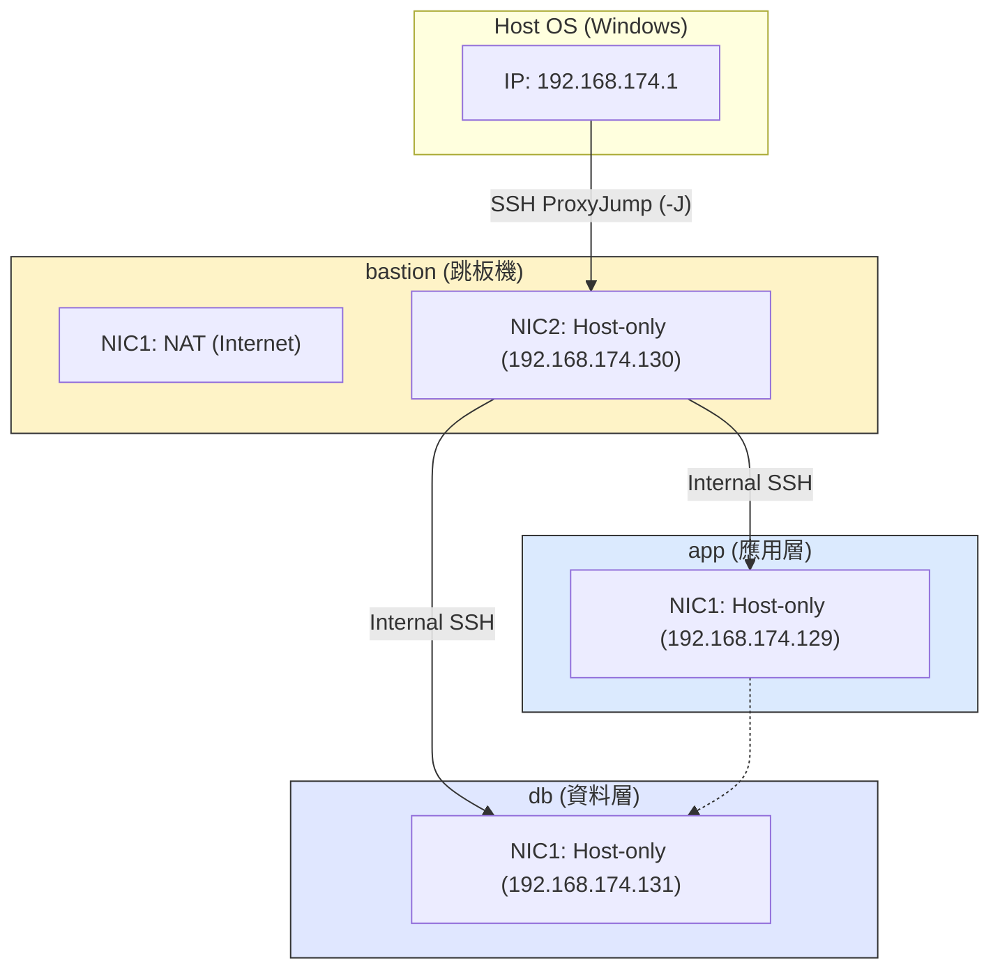

# W03｜多 VM 架構：分層管理與最小暴露設計

## 網路配置

| VM | 角色 | 網卡 | 模式 | IP | 開放埠與來源 |
|---|---|---|---|---|---|
| bastion | 跳板機 | NIC 1 | NAT | 192.168.78.138 | SSH from any |
| bastion | 跳板機 | NIC 2 | Host-only | 192.168.174.130 | — |
| app | 應用層 | NIC 1 | Host-only | 192.168.174.129 | SSH from 192.168.174.0/24 |
| db | 資料層 | NIC 1 | Host-only | （填入） | SSH from app + bastion |

## SSH 金鑰認證

- 金鑰類型：ed25519
- 公鑰部署到：（例：app 和 db 的 ~/.ssh/authorized_keys）
- 免密碼登入驗證：
  - bastion → app：
  ```bash
  hung@bastion:~$ ssh-copy-id hung@192.168.174.129
  /usr/bin/ssh-copy-id: INFO: attempting to log in with the new key(s), to filter out any that are already installed
  /usr/bin/ssh-copy-id: INFO: 1 key(s) remain to be installed -- if you are prompted now it is to install the new keys
  hung@192.168.174.129's password: 

  Number of key(s) added: 1

  Now try logging into the machine, with:   "ssh 'hung@192.168.174.129'"
  and check to make sure that only the key(s) you wanted were added.
  
  hung@bastion:~$ ssh hung@192.168.174.129
  Welcome to Ubuntu 24.04.4 LTS (GNU/Linux 6.17.0-19-generic x86_64)

  * Documentation:  https://help.ubuntu.com
  * Management:     https://landscape.canonical.com
  * Support:        https://ubuntu.com/pro

  Expanded Security Maintenance for Applications is not enabled.

  113 updates can be applied immediately.
  70 of these updates are standard security updates.
  To see these additional updates run: apt list --upgradable

  Enable ESM Apps to receive additional future security updates.
  See https://ubuntu.com/esm or run: sudo pro status

  Failed to connect to https://changelogs.ubuntu.com/meta-release-lts. Check your Internet connection or proxy settings

  Last login: Thu Apr 16 09:19:07 2026 from 192.168.174.130
  ```
  - bastion → db：（貼上輸出）

## 防火牆規則

### app 的 ufw status
```bash
hung@app:~$ sudo ufw status verbose
Status: active
Logging: on (low)
Default: deny (incoming), allow (outgoing), disabled (routed)
New profiles: skip

To                         Action      From
--                         ------      ----
22/tcp                     ALLOW IN    192.168.174.0/24
```

### db 的 ufw status
（貼上 `sudo ufw status verbose` 輸出）

### 防火牆確實在擋的證據
```bash
hung@bastion:~$ curl -m 5 http://192.168.174.129:8080 2>&1
curl: (28) Connection timed out after 5002 milliseconds
```

## ProxyJump 跳板連線
- 指令、驗證輸出：
  ```bash
  PS C:\Users\Kenny> ssh -J hung@192.168.174.130 hung@192.168.174.129 "hostname"
  hung@192.168.174.130's password:
  The authenticity of host '192.168.174.129 (<no hostip for proxy command>)' can't be established.
  ED25519 key fingerprint is SHA256:AMS+oxYtZoLwurOmHZ6JnpieiE8a2raxGOvSUBwrHiA.
  This host key is known by the following other names/addresses:
      C:\Users\Kenny/.ssh/known_hosts:18: 192.168.174.130
  Are you sure you want to continue connecting (yes/no/[fingerprint])? yes
  Warning: Permanently added '192.168.174.129' (ED25519) to the list of known hosts.
  hung@192.168.174.129's password:
  app
  ```
- SCP 傳檔驗證：
  ```bash
  PS C:\Users\Kenny\Documents> scp .\test.txt app:/tmp/
  hung@192.168.174.130's password:
  hung@192.168.174.129's password:
  test.txt                                                                              100%   23     0.4KB/s   00:00
  PS C:\Users\Kenny\Documents> ssh app
  hung@192.168.174.130's password:
  hung@192.168.174.129's password:
  Welcome to Ubuntu 24.04.4 LTS (GNU/Linux 6.17.0-19-generic x86_64)

  * Documentation:  https://help.ubuntu.com
  * Management:     https://landscape.canonical.com
  * Support:        https://ubuntu.com/pro

  Expanded Security Maintenance for Applications is not enabled.

  113 updates can be applied immediately.
  70 of these updates are standard security updates.
  To see these additional updates run: apt list --upgradable

  Enable ESM Apps to receive additional future security updates.
  See https://ubuntu.com/esm or run: sudo pro status

  Failed to connect to https://changelogs.ubuntu.com/meta-release-lts. Check your Internet connection or proxy settings

  Last login: Fri Apr 17 16:36:54 2026 from 192.168.174.130
  hung@app:~$ cat /tmp/test.txt
  Test file via ProxyJump
  ```

## 故障場景一：防火牆全封鎖

| 項目 | 故障前 | 故障中 | 回復後 |
|---|---|---|---|
| app ufw status | active + rules | deny all | active (allow 22) |
| bastion ping app | 成功 | Request timeout | 成功 |
| bastion SSH app | 成功 | **timed out** | 成功 |

## 故障場景二：SSH 服務停止

| 項目 | 故障前 | 故障中 | 回復後 |
|---|---|---|---|
| ss -tlnp grep :22 | 有監聽 | 無監聽 | 有監聽 |
| bastion ping app | 成功 | 成功 | 成功 |
| bastion SSH app | 成功 | **refused** | 成功 |

## timeout vs refused 差異
- Connection timed out：通常發生在防火牆攔截封包的情況下。封包被靜默丟棄（Drop），客戶端沒有收到任何回應，只能持續等待直到超時。這指向的是 L3.5 防火牆層級的問題。

- Connection refused：發生在網路通暢但目標服務未啟動的情況下。目標主機的回應封包明確表示該 Port 沒有程式在監聽（RST）。這指向的是 L4 服務層級的問題。

## 網路拓樸圖


## 排錯紀錄
- 症狀：初次嘗試 ssh app 時出現 Permission denied (publickey)。

- 診斷：檢查 bastion 是否已透過 ssh-copy-id 傳送公鑰，並在 app 上確認 ~/.ssh/authorized_keys 的權限是否為 600。

- 修正：重新執行 ssh-copy-id 並確保 app 的 sshd_config 允許金鑰登入。

- 驗證：再次嘗試 ssh app 成功進入，且不再詢問密碼。

## 設計決策
- **為什麼 db 允許 bastion 直連而不是只允許從 app 跳？**  
  
  雖然僅允許從 app 連線最安全，但考慮到維護便利性（Management Access），當 app 故障或需要進行資料庫備份維護時，管理者需要一條直接從跳板機進入 db 的管理路徑。透過 ufw 嚴格限制僅限 bastion 的 IP 來源，可以在安全與運維效率之間取得平衡。