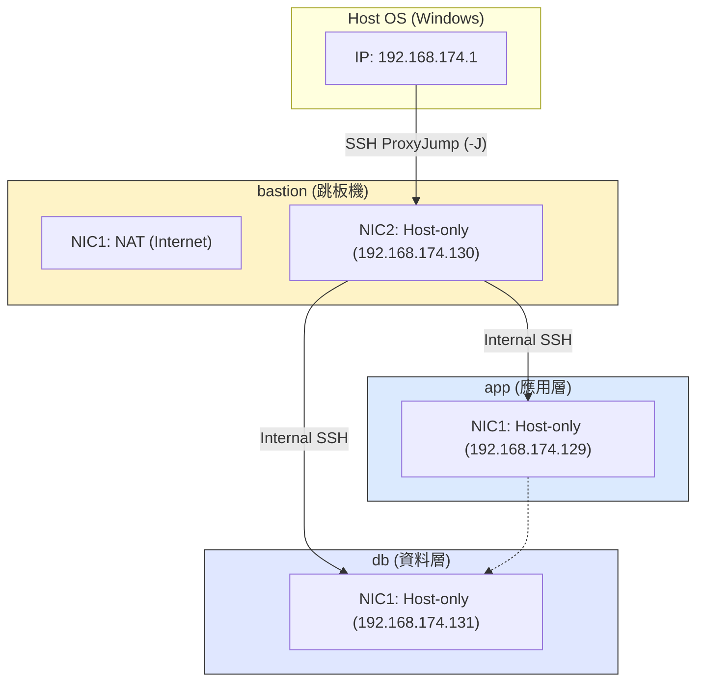

# w03 網路拓樸圖

```mermaid
flowchart TB
    subgraph Host_OS ["Host OS (Windows)"]
        H_IP["IP: 192.168.174.1"]
    end

    subgraph BASTION ["bastion (跳板機)"]
        B_NAT["NIC1: NAT (Internet)"]
        B_HO["NIC2: Host-only (192.168.174.130)"]
    end

    subgraph APP ["app (應用層)"]
        A_HO["NIC1: Host-only (192.168.174.129)"]
    end

    subgraph DB ["db (資料層)"]
        D_HO["NIC1: Host-only (192.168.174.131)"]
    end

    H_IP -- "SSH ProxyJump (-J)" --> B_HO
    B_HO -- "Internal SSH" --> A_HO
    B_HO -- "Internal SSH" --> D_HO
    A_HO -.-> D_HO

    style BASTION fill:#fef3c7,stroke:#333
    style APP fill:#dbeafe,stroke:#333
    style DB fill:#e0e7ff,stroke:#333
```